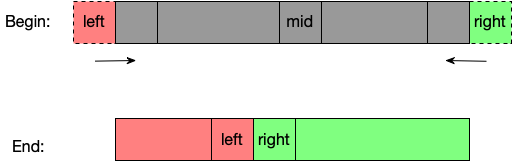
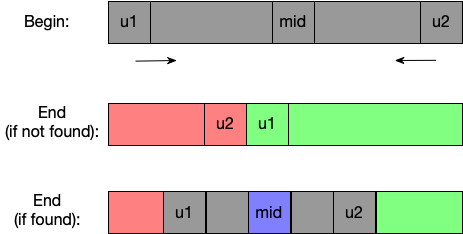
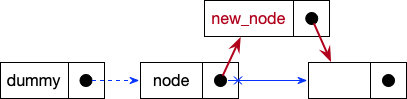
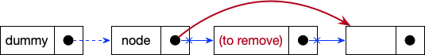
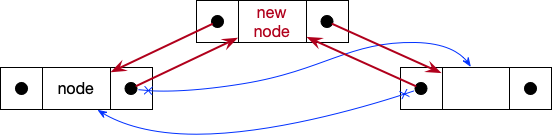
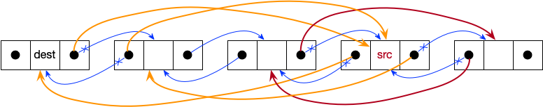
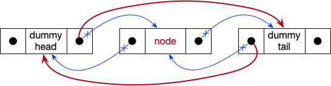

# Data Structures and Algorithms

## Array
### Binary Search with 2 states
This is useful for searching the first/last elements satisfying a given binary condition.



```
--8<-- "docs/software/src/array/binary_search2.py"
```

??? Notes
    - Add virtual boundaries to handle corner cases of empty array or single state.
    - In the end, `left` and `right` mark ending and starting of two states.


### Binary Search with 3 states


```
--8<-- "docs/software/src/array/binary_search3.py"
```

Notes:

- `u1` and `u2` marks the range of unknown areas, which gradually shrinks during search.
- In the end, if target not found, `u1` and `u2` run across each other. The unknown range is also zero.


## Linked List
### Singly Linked List

```
--8<-- "docs/software/src/singly_linked_list/list_node.py"
```

???+ "Dummy Head"
    Add a dummy head such that we do not need to specially treat the corner case of `None` head.

#### Traversal
```
--8<-- "docs/software/src/singly_linked_list/get_tail.py"
```


#### Insert after a given node


```
--8<-- "docs/software/src/singly_linked_list/insert_after.py"
```


#### Move node after another given node


```
--8<-- "docs/software/src/singly_linked_list/move_after.py"
```


#### Remove node after a given one


```
--8<-- "docs/software/src/singly_linked_list/remove_after.py"
```


### Doubly linked list

```
--8<-- "docs/software/src/doubly_linked_list/list_node.py"
```


#### Insert


```
--8<-- "docs/software/src/doubly_linked_list/insert_after.py"
```


#### Move


```
--8<-- "docs/software/src/doubly_linked_list/move_this.py"
```


#### Remove


```
--8<-- "docs/software/src/doubly_linked_list/remove_this.py"
```


## Graph

## Tree
### Binary tree
### Binary search tree
### Heap
Heaps are special ==complete binary== trees.

- Max heap: For all node, `node.value` $\ge$ value of all recursive children.
- Min heap: For all node, `node.value` $\le$ value of all recursive children.

